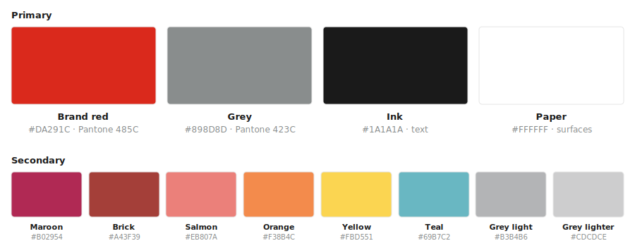
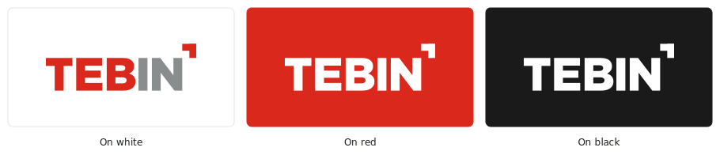

<div align="center">


# tebin-style

**Brand kits for AI coding agents and humans** — W3C **DTCG** design tokens,
downloadable logos, and machine-readable usage rules. Point an agent at a theme;
it applies the tokens (CSS, Tailwind, DTCG JSON, or TypeScript) and places the assets.

</div>

---

## TEBIN Classic

The 2017 TEBIN corporate identity: Pantone red + grey, Roboto type, Arial for documents.

**Download the logo —**
[full SVG](https://raw.githubusercontent.com/4aykas/tebin-style/main/themes/tebin-classic/assets/logo/logo-full.svg)
·
[white SVG](https://raw.githubusercontent.com/4aykas/tebin-style/main/themes/tebin-classic/assets/logo/logo-full-white.svg)
·
[corner mark](https://raw.githubusercontent.com/4aykas/tebin-style/main/themes/tebin-classic/assets/misc/corner-mark.svg)

### Palette



- **Primary** — `Brand red` for emphasis and the logo; `Grey` for secondary text and UI; `Ink` for body text; `Paper` for surfaces.
- **Secondary** — accents for charts, illustration, and category coding. Never recolor the logo with them.

### Logo usage



- On dark or red backgrounds use the **all-white** logo; the two-color logo is for light backgrounds only.
- Keep clear space around the logo of at least the **height of the “B”**.
- Never distort, add shadows, or recolor it outside the palette (red / grey / white / black).
- The **corner mark** may stand alone — e.g. top-right of a photo or slide — to signal TEBIN authorship.

Full machine-readable rules: [`rules/dist/rules.md`](./rules/dist/rules.md) (category `brand`).

---

## Install

Prerequisites: **Node ≥ 18** and **pnpm**. The skill and MCP server read
**generated** files, so build once after cloning.

```bash
git clone https://github.com/4aykas/tebin-style.git
cd tebin-style
pnpm install
pnpm build      # generates dist/*, registry/index.json, rules/dist/*
```

Note the absolute path of the clone — you point your agent at it below
(`/abs/path/to/tebin-style`; on Windows use `C:/Users/you/tebin-style`).

## Use it

There are two ways to plug in — a **skill** (natural-language workflow) and an
**MCP server** (read-only tools). Use either or both.

**Claude Code**

```bash
# Skill — copy into your skills dir (all projects, or .claude/skills in one)
cp -r skill/tebin-style ~/.claude/skills/tebin-style
# MCP server
claude mcp add tebin-style -- pnpm --dir /abs/path/to/tebin-style start:mcp
```

Then ask: *“use the TEBIN Classic theme in this project.”* Verify the server
with `claude mcp list`.

**Codex** — add the MCP server to `~/.codex/config.toml`:

```toml
[mcp_servers.tebin-style]
command = "pnpm"
args = ["--dir", "/abs/path/to/tebin-style", "start:mcp"]
```

Place the skill at `~/.codex/skills/tebin-style` if your version auto-discovers skills.

**Any other MCP client** — run `pnpm --dir /abs/path/to/tebin-style start:mcp`
(stdio) and register it the way your host expects. Works with any
[MCP](https://modelcontextprotocol.io) client.

### MCP tools (read-only)

| Tool | Input | Returns |
|------|-------|---------|
| `list_themes` | `{ industry?, mood?, query? }` | matching theme summaries |
| `get_theme` | `{ id, format? }` | tokens in `css` \| `tailwind` \| `dtcg` \| `ts` |
| `get_asset` | `{ id, assetId? }` | asset list, or one asset (SVG text / binary base64) |
| `list_rules` | `{ category?, severity?, tag?, query? }` | matching design rules |
| `get_rule` | `{ id }` | a single design rule |

---

## What's inside

**Themes** — each has `tokens.json` (canonical DTCG), generated `dist/*`,
`assets/`, and `theme.json`:

| id | name | industry | brand |
|----|------|----------|-------|
| `tebin-classic` | TEBIN Classic | engineering, industrial | `#DA291C` |
| `tebin` | TEBIN | engineering, industrial | `#DA291C` |
| `slate` | Slate | saas, web, general | `#2563EB` |

**Rules** — a database of design rules (`MUST` / `SHOULD` / `NEVER`): global
UI/UX/accessibility rules plus TEBIN `brand` rules. Source
[`rules/rules.json`](./rules/rules.json), digest
[`rules/dist/rules.md`](./rules/dist/rules.md).

## Development

```bash
pnpm validate   # JSON Schema + integrity checks
pnpm build      # generate dist/* and registry/index.json
pnpm check      # fail if generated files drift from source
pnpm test       # run the test suite
```

`themes/<id>/tokens.json` is the only file you hand-edit; everything in `dist/`
and `registry/index.json` is generated.

## License

Code and tokens: MIT (see [LICENSE](./LICENSE)). Brand assets carry their own
license per theme — © TEBIN, all rights reserved. Do not reuse a brand's logo
for a different brand.
