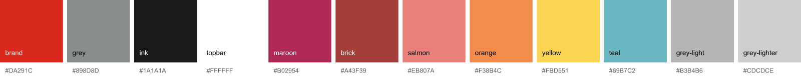
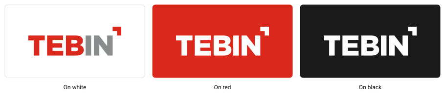

# tebin-style

**Brand kits for AI agents and people.** DTCG design tokens, logos as SVG and
PNG, machine-readable design rules, and one self-contained design guide per
theme.

---

## Download

Click a size and save the image. No terminal needed. Every link below is a
direct, permanent URL: paste it into a chat, a document or a script and it
serves the file.

| | PNG | Vector | Design guide |
|---|---|---|---|
| **TEBIN Classic** logo | [512](https://raw.githubusercontent.com/4aykas/tebin-style/main/themes/tebin-classic/assets/png/logo-full-512.png) · [1024](https://raw.githubusercontent.com/4aykas/tebin-style/main/themes/tebin-classic/assets/png/logo-full-1024.png) · [2048](https://raw.githubusercontent.com/4aykas/tebin-style/main/themes/tebin-classic/assets/png/logo-full-2048.png) | [SVG](https://raw.githubusercontent.com/4aykas/tebin-style/main/themes/tebin-classic/assets/logo/logo-full.svg) | [DESIGN.md](themes/tebin-classic/DESIGN.md) |
| white, on red / charcoal | [on red](https://raw.githubusercontent.com/4aykas/tebin-style/main/themes/tebin-classic/assets/png/logo-full-white-1024-on-brand.png) · [on charcoal](https://raw.githubusercontent.com/4aykas/tebin-style/main/themes/tebin-classic/assets/png/logo-full-white-1024-on-charcoal.png) | [SVG](https://raw.githubusercontent.com/4aykas/tebin-style/main/themes/tebin-classic/assets/logo/logo-full-white.svg) | |
| corner mark | [128](https://raw.githubusercontent.com/4aykas/tebin-style/main/themes/tebin-classic/assets/png/corner-mark-128.png) · [256](https://raw.githubusercontent.com/4aykas/tebin-style/main/themes/tebin-classic/assets/png/corner-mark-256.png) · [512](https://raw.githubusercontent.com/4aykas/tebin-style/main/themes/tebin-classic/assets/png/corner-mark-512.png) | [SVG](https://raw.githubusercontent.com/4aykas/tebin-style/main/themes/tebin-classic/assets/misc/corner-mark.svg) | |
| **TEBIN** (web) logo | [512](https://raw.githubusercontent.com/4aykas/tebin-style/main/themes/tebin/assets/png/logo-full-512.png) · [1024](https://raw.githubusercontent.com/4aykas/tebin-style/main/themes/tebin/assets/png/logo-full-1024.png) · [2048](https://raw.githubusercontent.com/4aykas/tebin-style/main/themes/tebin/assets/png/logo-full-2048.png) | [SVG](https://raw.githubusercontent.com/4aykas/tebin-style/main/themes/tebin/assets/logo/logo-full.svg) | [DESIGN.md](themes/tebin/DESIGN.md) |

Pick 512 px for email and small web use, 1024 px for documents and slides,
2048 px for print.

The white logo ships on a red tile and on a charcoal tile, never on
transparency. A white logo on transparency looks like an empty file in every
preview. The tiles already carry the correct clear space.

Every asset in every size: [tebin-classic](themes/tebin-classic/DESIGN.md) ·
[tebin](themes/tebin/DESIGN.md) · [slate](themes/slate/DESIGN.md).
For machines: [llms.txt](llms.txt) · [registry/index.json](registry/index.json).

## Palette

| Colour | HEX | RGB (Word, Excel) | Pantone |
|---|---|---|---|
| Brand red | `#DA291C` | 218, 41, 28 | 485 C |
| Grey | `#898D8D` | 137, 141, 141 | 423 C |
| Ink | `#1A1A1A` | 26, 26, 26 | — |

Full palette with CMYK and the secondary colours:
[DESIGN.md](themes/tebin-classic/DESIGN.md) ·
[colors.csv](themes/tebin-classic/dist/colors.csv).

**Red text needs a different red.** The brand red clears 4.5:1 on neither a
dark nor a light surface, and no single red can — the luminance window is
empty for any hue. Small red text uses `brand-on-dark` (`#EA6359`) or
`brand-on-light` (`#C7251A`). `#DA291C` stays the colour for the logo,
fills, borders and large text.

### Logo rules

- Use the **all-white** logo on dark or red backgrounds. The two-colour logo is
  for light backgrounds only.
- Keep clear space of at least the **height of the "B"** on all sides.
- Never stretch, shadow or recolour the logo.
- The **corner mark** may stand alone — top-right of a photo or slide — to mark
  TEBIN authorship.

## Start here

I need the logo and the colours →
[quick start](docs/guide/quick-start.md) ·
[Word, Excel, PowerPoint, Google Docs](docs/guide/office.md)

I am wiring up an agent or a codebase →
[agents and MCP](docs/guide/ai-agents.md) ·
[developer guide](docs/guide/developers.md)

## Themes

| id | name | for | brand | design |
|----|------|-----|-------|--------|
| `tebin-classic` | TEBIN Classic | print and documents | `#DA291C` | [DESIGN.md](themes/tebin-classic/DESIGN.md) |
| `tebin` | TEBIN | the web, tebin.pro style | `#DA291C` | [DESIGN.md](themes/tebin/DESIGN.md) |
| `slate` | Slate | non-TEBIN projects, MIT | `#2563EB` | [DESIGN.md](themes/slate/DESIGN.md) |

Each theme holds `tokens.json` (the DTCG source), generated `dist/` (CSS,
Tailwind, DTCG JSON, TypeScript, `colors.csv`), `assets/` (SVG + PNG), and a
generated `DESIGN.md`.

Tokens cover colours, semantic roles, type, spacing and radii. A **role** is a
pointer, not a copy: `role.surface` names `color.paper`, so repointing the
colour moves every role that uses it. The `tebin` theme also carries the type
scale and the spacing scale used on tebin.pro.

## Rules

A database of 62 design rules, each `MUST`, `SHOULD` or `NEVER`, most with the
reason it exists. Covers UI, UX, accessibility and typography, plus TEBIN brand
rules. Source: [`rules/rules.json`](rules/rules.json). Readable digest:
[`rules/dist/rules.md`](rules/dist/rules.md).

## Licence

Code and tokens: MIT — see [LICENSE](LICENSE). Brand assets: © TEBIN, all
rights reserved. Do not reuse a brand's logo for another brand.
